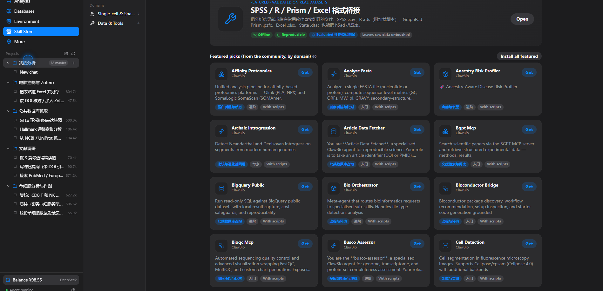
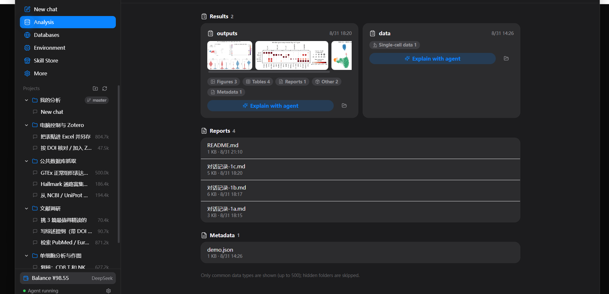

<div align="center">

# BioDSH

**The bioinformatics agent desktop for clinicians and wet‑lab scientists — built on [DeepSeek Harness](https://github.com/deepseek-ai/deepseek-harness).**

Everything is a plugin. Every analysis is a sentence.

[中文说明](README.zh.md) · [Download](https://github.com/sagirimo/BioDSH/releases/latest) · [DeepSeek Harness](https://github.com/deepseek-ai/deepseek-harness)

</div>

---

BioDSH is a one‑click desktop app that puts a bioinformatics agent in front of people who don't use a terminal. Drop in your data, say what you want in plain language, and read the conclusion. It runs locally, never modifies your original files, and can run fully offline inside a hospital or lab intranet.

It is a thin, friendly shell around **DeepSeek Harness (`dsh`)**: the agent runtime, the plugin system, and the reproducible session log are all `dsh`. BioDSH adds a clinician‑facing UI, a bioinformatics skill store, a bundled Python analysis environment, and a set of evaluated official skills.

<div align="center">


</div>

## Download

Grab an installer from the [**latest release**](https://github.com/sagirimo/BioDSH/releases/latest):

| Platform | File | Notes |
| --- | --- | --- |
| Windows 10/11 | `BioDSH_*_x64-setup.exe` | Double‑click to install. On first run click *More info → Run anyway*. |
| macOS 12+ (Apple silicon) | `BioDSH_*_aarch64.dmg` | On first open, right‑click → *Open*. |
| Linux | `BioDSH_*_amd64.deb` | Debian/Ubuntu. |

The app checks for new releases in the background and offers a one‑click **download → verify signature → install → restart**. Nothing is sent anywhere; the update feed is just this repo's `latest.json`.

## What it does

- **Everything is a plugin.** The best open‑source bioinformatics skills — 2,000+ community skills organised into 10 domains — plus a handful of evaluated, offline, reproducible official skills. Install one with a click.
- **Every analysis is traceable.** Everything the model sees goes into an append‑only session log. In the chat, intermediate steps fold into a single line and expand on demand; conversations export for an advisor or reviewer.
- **Four real example projects** ship with the app: single‑cell analysis & plots, literature review, public‑database retrieval, and desktop control with Zotero.
- **No coding.** A one‑click Python environment (scanpy, anndata, pandas, matplotlib) is bundled; skills that need it install it once.
- **Desktop control.** The agent can drive other apps (Excel, Prism, SPSS…) with real mouse and keyboard, with a clear "BioDSH is controlling the computer" banner on screen.
- **Data safety & offline.** Original files are never modified; each analysis writes into a new subfolder. Fully‑offline mode talks to a local or intranet model and makes no outbound requests.

## How it works

```
┌────────────────────────────────────────────┐
│  BioDSH (Tauri desktop shell)               │
│  • clinician‑facing UI (React)              │
│  • skill store · data view · environment    │
│  • bundled Python + official skills         │
│  ┌──────────────────────────────────────┐  │
│  │  DeepSeek Harness (dsh)               │  │
│  │  agent runtime · plugins · session log │  │
│  └──────────────────────────────────────┘  │
└────────────────────────────────────────────┘
```

A "skill" is a `dsh` plugin: a folder with a `SKILL.md` (instructions the agent follows) and optional scripts. The official skills live in [`biodsh-core/skills/`](biodsh-core/skills); the desktop app is in [`desktop/`](desktop).

## Build from source

Prerequisites: **Node.js 22+**, **Rust (stable)**, and the platform Tauri prerequisites (on Linux: `libwebkit2gtk-4.1-dev libappindicator3-dev librsvg2-dev patchelf`).

```bash
cd desktop
npm ci                        # install dependencies
node scripts/stage-dsh.mjs    # stage the dsh runtime
node scripts/sync-skills.mjs  # official skills → resources + store catalog
npm run tauri dev             # run the app
# or a full installer build:
npm run tauri build
```

The release recipe is at [`docs/release.workflow.yml`](docs/release.workflow.yml) — copy it to `.github/workflows/release.yml`, then push a tag such as `desktop-tauri-v0.2.1` to build installers for all platforms and publish a release with `latest.json`. Auto‑update signing needs two repository secrets, documented at the top of that file.

## Repository layout

| Path | What |
| --- | --- |
| `desktop/` | The Tauri desktop app — React UI (`src/`), Rust backend (`src-tauri/`), build scripts (`scripts/`), store catalog (`store/`). |
| `biodsh-core/skills/` | The evaluated official skills shipped with the app. |
| `desktop/resources/` | Bundled resources: the analysis‑environment spec, example‑project sessions, helper scripts. |

## License

[MIT](LICENSE) for BioDSH's own code. Bundled and downloaded components — DeepSeek Harness, community skills, the Python toolchain and packages — keep their own licenses.

## Acknowledgements

Built on [DeepSeek Harness](https://github.com/deepseek-ai/deepseek-harness). BioDSH is an independent project and is not affiliated with or endorsed by DeepSeek.
